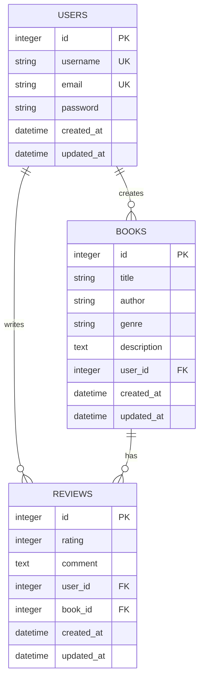

# Book Review System API

A RESTful API for a book review system built with Node.js, Express, and SQLite.

## Features

- User authentication with JWT
- Book management (CRUD operations)
- Review system with ratings
- Search and filter books
- Pagination support

## Tech Stack

- Node.js with Express.js
- SQLite database with Sequelize ORM
- JWT for authentication
- Environment variables for configuration

## Prerequisites

- Node.js (v14 or higher)
- npm or yarn

## Setup

1. Clone the repository:
```bash
git clone <repository-url>
cd book-review-system
```

2. Install dependencies:
```bash
npm install
```

3. Create a `.env` file in the root directory:
```env
PORT=3000
JWT_SECRET=your_jwt_secret
DB_PATH=./database.sqlite
```

4. Run migrations:
```bash
npx sequelize-cli db:migrate
```

5. Start the server:
```bash
npm start
```

## API Documentation

### Authentication

#### Register a new user
```bash
POST /auth/signup
Content-Type: application/json

{
  "username": "testuser",
  "email": "test@example.com",
  "password": "password123"
}
```

#### Login
```bash
POST /auth/login
Content-Type: application/json

{
  "email": "test@example.com",
  "password": "password123"
}
```

### Books

#### Get all books (with pagination and filters)
```bash
GET /books?page=1&limit=10&search=title&genre=Fiction
```

#### Get book by ID
```bash
GET /books/:id
```

#### Add a new book (requires authentication)
```bash
POST /books
Authorization: Bearer <jwt_token>
Content-Type: application/json

{
  "title": "Book Title",
  "author": "Author Name",
  "genre": "Fiction",
  "description": "Book description"
}
```

#### Update a book (requires authentication)
```bash
PUT /books/:id
Authorization: Bearer <jwt_token>
Content-Type: application/json

{
  "title": "Updated Title",
  "author": "Updated Author",
  "genre": "Updated Genre",
  "description": "Updated description"
}
```

#### Delete a book (requires authentication)
```bash
DELETE /books/:id
Authorization: Bearer <jwt_token>
```

### Reviews

#### Get book reviews
```bash
GET /books/:book_id/reviews?page=1&limit=10
```

#### Add a review (requires authentication)
```bash
POST /books/:book_id/reviews
Authorization: Bearer <jwt_token>
Content-Type: application/json

{
  "rating": 5,
  "comment": "Great book!"
}
```

#### Update a review (requires authentication)
```bash
PUT /reviews/:id
Authorization: Bearer <jwt_token>
Content-Type: application/json

{
  "rating": 4,
  "comment": "Updated review"
}
```

#### Delete a review (requires authentication)
```bash
DELETE /reviews/:id
Authorization: Bearer <jwt_token>
```

## Testing with Postman

A Postman collection is provided for testing the API endpoints. Follow these steps to use it:

1. **Import the Collection**
   - Open Postman
   - Click "Import" button
   - Select the `Book_Review_System.postman_collection.json` file

2. **Set up Environment Variables**
   - Create a new environment in Postman
   - Add these variables:
     - `baseUrl`: `http://localhost:3000` (or your server URL)
     - `token`: Leave empty initially, will be filled after login

3. **Testing Flow**
   a. **Authentication**
      - First, use the "Signup" request to create a new user
      - Then, use the "Login" request to get a JWT token
      - Copy the token from the login response and set it as the `token` environment variable
      - Use "Get Current User" to verify authentication

   b. **Books**
      - "Get All Books" - Test pagination and filters
      - "Add Book" - Create a new book (requires authentication)
      - "Get Book by ID" - View book details
      - "Update Book" - Modify book details (requires authentication)
      - "Delete Book" - Remove a book (requires authentication)

   c. **Reviews**
      - "Get Book Reviews" - View reviews for a book
      - "Add Review" - Create a new review (requires authentication)
      - "Update Review" - Modify your review (requires authentication)
      - "Delete Review" - Remove your review (requires authentication)

4. **Example Test Flow**
   ```bash
   # 1. Signup
   POST {{baseUrl}}/auth/signup
   {
     "username": "testuser",
     "email": "test@example.com",
     "password": "password123"
   }

   # 2. Login and get token
   POST {{baseUrl}}/auth/login
   {
     "email": "test@example.com",
     "password": "password123"
   }
   # Copy token from response and set in environment

   # 3. Add a book
   POST {{baseUrl}}/books
   Authorization: Bearer {{token}}
   {
     "title": "The Great Gatsby",
     "author": "F. Scott Fitzgerald",
     "genre": "Fiction",
     "description": "A story of the fabulously wealthy Jay Gatsby..."
   }

   # 4. Add a review
   POST {{baseUrl}}/books/1/reviews
   Authorization: Bearer {{token}}
   {
     "rating": 5,
     "comment": "An amazing book that everyone should read!"
   }
   ```

5. **Tips for Testing**
   - Always check the response status codes
   - Verify that protected routes require authentication
   - Test pagination with different page and limit values
   - Try searching and filtering books
   - Test error cases (invalid data, unauthorized access, etc.)

## Database Schema

### Users
- id (INTEGER, PRIMARY KEY)
- username (STRING, UNIQUE)
- email (STRING, UNIQUE)
- password (STRING)
- created_at (DATETIME)
- updated_at (DATETIME)

### Books
- id (INTEGER, PRIMARY KEY)
- title (STRING)
- author (STRING)
- genre (STRING)
- description (TEXT)
- user_id (INTEGER, FOREIGN KEY)
- created_at (DATETIME)
- updated_at (DATETIME)

### Reviews
- id (INTEGER, PRIMARY KEY)
- rating (INTEGER)
- comment (TEXT)
- user_id (INTEGER, FOREIGN KEY)
- book_id (INTEGER, FOREIGN KEY)
- created_at (DATETIME)
- updated_at (DATETIME)

### Entity Relationship Diagram



## Design Decisions

1. **Database Choice**: SQLite was chosen for its simplicity and zero-configuration setup, making it ideal for development and small to medium applications.

2. **Authentication**: JWT was chosen for its stateless nature and ease of implementation.

3. **API Design**:
   - RESTful principles followed
   - Consistent error handling
   - Pagination for list endpoints
   - Search and filter capabilities
   - Proper HTTP status codes

4. **Security**:
   - Passwords are hashed
   - JWT tokens for authentication
   - Input validation
   - Protected routes for authenticated users only

5. **Code Organization**:
   - MVC pattern
   - Repository pattern for database operations
   - Use cases for business logic
   - Middleware for common functionality
   - Environment variables for configuration 